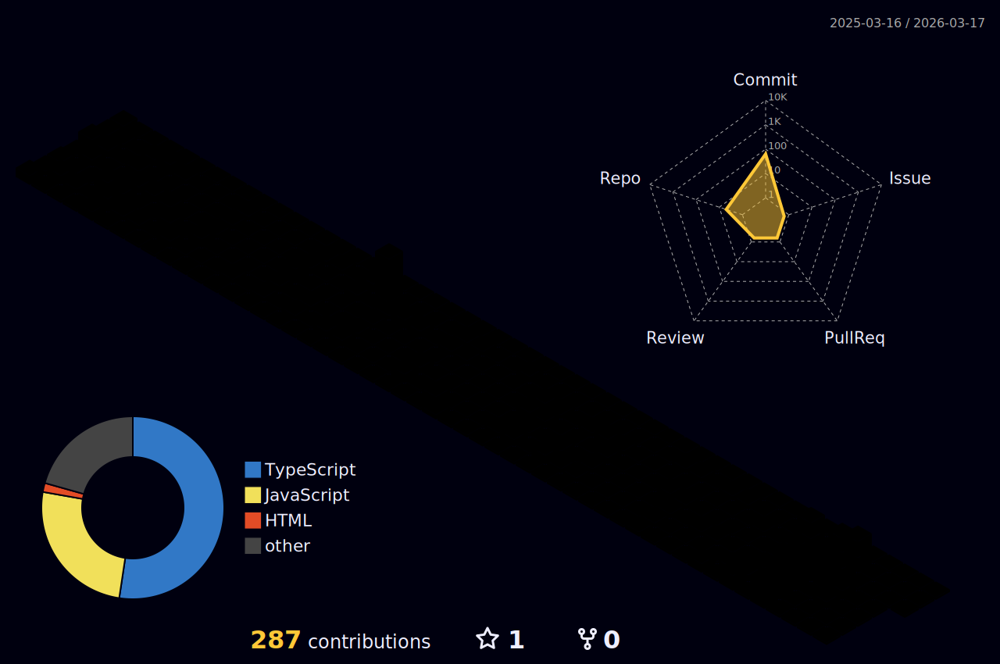

  

I'm a full-stack engineer who's spent the last 2+ years turning startup ideas into production-grade applications that users actually love and investors actually fund. Whether it's a MongoDB-powered dashboard or a PostgreSQL-backed SaaS platform, I make sure it's fast, maintainable, and ready to 10x.

### Crafting Scalable Digital Experiences
I write software that ships.

My work spans pixel-perfect React frontends, bulletproof Node/Express backends, and the occasional DevOps pipeline that actually works first time. I build with React, Next.js, Node.js, Express, MongoDB, PostgreSQL, Tailwind, and whatever tool makes the product better. Currently advancing my DevOps skills while feeding my curiosity for zero-downtime deployments — because the best applications never go down on their users.

I'm currently working on Infrastructure as Code (IaC) and AWS & AI automation projects to streamline deployments and build truly resilient systems. While keeping the system-design and DSA muscles strong, I'm always open to collaborating on ambitious projects — especially those that demand clean architecture and smart optimizations.

<h3 align="left">Languages and Tools:</h3>

                         

###  Github Contributions 

